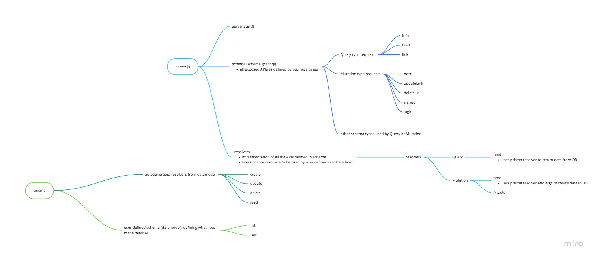

prisma backend on an AWS aurora server.

server: https://app.prisma.io/tang-li-qun-b48c3d/services/prisma-us1/tut-react-graphql-prisma-backend/dev/databrowser
prisma admin (old): https://us1.prisma.sh/tang-li-qun-b48c3d/tut-react-graphql-prisma-backend/dev/_admin
prisma admin (new): https://us1.prisma.sh/tang-li-qun-b48c3d/graphql-prisma-backend/dev/_admin

how everything fits together (the graphql part) [interactive ver.](https://miro.com/welcomeonboard/KVSKSdgC5LywSmS5NjyB8WN8G8YFJbI5OA10t4TtpqTxRCGO08PRYkknC0Sq9FqX)



some example queries:

```graphql
# Write your query or mutation here
mutation Add {
  post(url: "https://www.hackernews.com", description: "for hackish news") {
    id
  }
}

query View {
  feed {
    id
    description
    url
  }
}

query GetLink {
  link(id: "ck2rbvy383wr90b095b28yq17") {
    url
    description
  }
}

mutation DeleteLink {
  deleteLink(id: "link-1") {
    id
    description
    url
  }
}

mutation UpdateLink {
  updateLink(
    id: "ck2rbzwpau2k50b00z79iwtx6"
    url: "www.testingjavascript.com"
    description: "the current gold standard in demystifying the act of writing tests."
  ) {
    id
    url
    description
  }
}
```

# ref

- boilerplates: https://github.com/graphql-boilerplates
- codegen: https://github.com/dotansimha/graphql-code-generator
- codegen: https://medium.com/@pongsatt/how-to-generate-typescript-types-from-graphql-schemas-8d63ed6cda2e
- https://medium.com/@pongsatt/how-to-generate-typescript-types-from-graphql-schemas-8d63ed6cda2e
- https://www.prisma.io/tutorials/a-guide-to-common-resolver-patterns-ct08/#scenario:-implementing-relations-with-prisma-client
